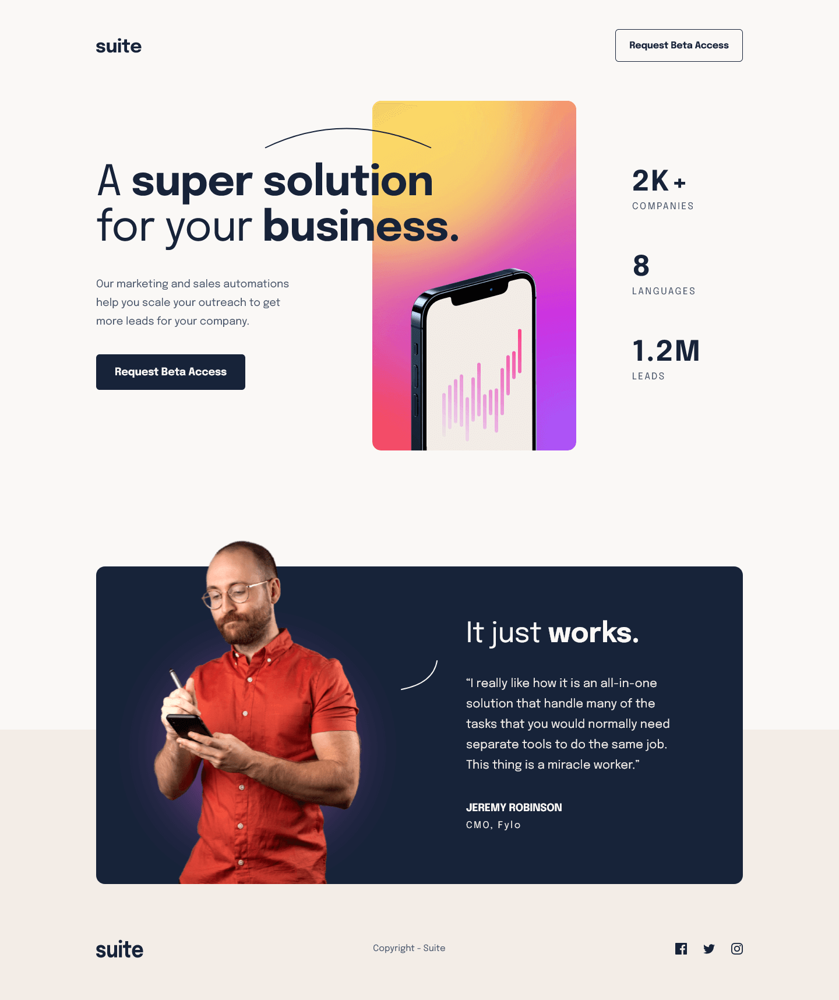

# Frontend Mentor - Suite landing page solution

This is a solution to the [Suite landing page challenge on Frontend Mentor](https://www.frontendmentor.io/challenges/suite-landing-page-tj_eaU-Ra). Frontend Mentor challenges help you improve your coding skills by building realistic projects.

## Table of contents

- [Overview](#overview)
  - [Screenshot](#screenshot)
  - [Links](#links)
- [My process](#my-process)
  - [Built with](#built-with)
- [Author](#author)
## Overview

### The challenge

Users should be able to:

- View the optimal layout depending on their device's screen size
- See hover states for interactive elements

### Screenshot



### Links

- Solution URL: [Add solution URL here](https://github.com/gladstone28/suite-landing-FM)
- Live Site URL: [Add live site URL here](https://gladstone28.github.io/suite-landing-FM/)

## My process

### Built with

- Semantic HTML5 markup
- CSS custom properties
- Sass
- Flexbox
- CSS Grid
- Mobile-first workflow


### What I learned

Use this section to recap over some of your major learnings while working through this project. Writing these out and providing code samples of areas you want to highlight is a great way to reinforce your own knowledge.

To see how you can add code snippets, see below:

```html
<h1>Some HTML code I'm proud of</h1>
```
```css
.proud-of-this-css {
  color: papayawhip;
}
```
```js
const proudOfThisFunc = () => {
  console.log('🎉')
}
```

If you want more help with writing markdown, we'd recommend checking out [The Markdown Guide](https://www.markdownguide.org/) to learn more.

**Note: Delete this note and the content within this section and replace with your own learnings.**

### Continued development

Use this section to outline areas that you want to continue focusing on in future projects. These could be concepts you're still not completely comfortable with or techniques you found useful that you want to refine and perfect.

**Note: Delete this note and the content within this section and replace with your own plans for continued development.**

### Useful resources

- [Example resource 1: Getting started with Figma: A beginner's guide](https://www.youtube.com/watch?v=eZJOSK4gXl4) - This helped me to understand Figma. Please watch.
- [Example resource 2:Master Figma UI Design in 15 Minutes | This Tutorial Is For You!](https://www.youtube.com/watch?v=uQsyobT2Rv8&t=302s) - Z. I'd recommend this to anyone still learning this concept.
- [Example resource 3:Learn Figma in 2024 | Beginner tutorial](https://www.youtube.com/watch?v=mIcKzBhQNZM)-Hi everyone! In this video, I talk about all the tools and features someone new to Figma needs to understand to start designing with the tool
- [Example resource 4:Figma Tutorial for Beginners (2024): Website Design](https://www.youtube.com/watch?v=clSHs94hNNc)-In this beginner-friendly lesson, you will get a crash course in Figma for web designers.

## Author

- Github - [@gladstone28](https://github.com/gladstone28/suite-landing-FM)
- Frontend Mentor - [@gladstone28](https://www.frontendmentor.io/profile/gladstone28)
- Twitter - [@gladdyus](https://www.twitter.com/gladdyus)


## Acknowledgments

This is where you can give a hat tip to anyone who helped you out on this project. Perhaps you worked in a team or got some inspiration from someone else's solution. This is the perfect place to give them some credit.

**Note: Delete this note and edit this section's content as necessary. If you completed this challenge by yourself, feel free to delete this section entirely.**
